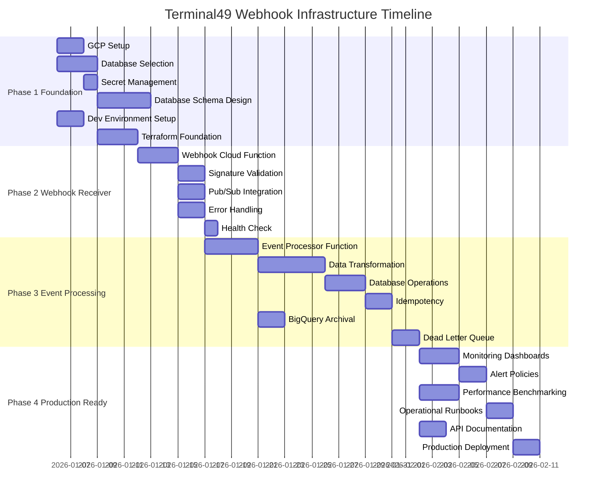
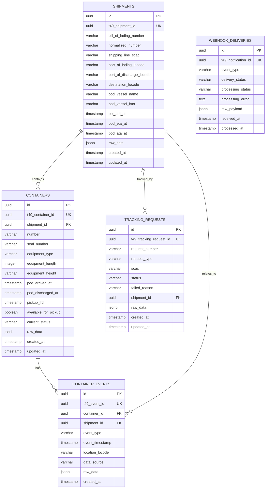

# Terminal49 Webhook Infrastructure - Appendices

## Project Timeline (Gantt Chart)

**Total Duration**: 5 weeks (35 days)

**Critical Path**: Database Schema Design → Event Processor → Data Transformation → Database Operations → Idempotency → Performance Benchmarking → Production Deployment

---

## Open Questions

### Technical Questions
1. **Database Selection**: Should we use Supabase PostgreSQL, Cloud SQL PostgreSQL, or a hybrid approach with BigQuery?
   - **Impact**: Affects query performance, cost, and development complexity
   - **Decision Needed By**: End of Week 1
   - **Recommendation**: Hybrid approach (Supabase for operational data, BigQuery for archival)

2. **Secret Management**: What's the most cost-effective alternative to Secret Manager?
   - **Impact**: Security posture and operational costs
   - **Decision Needed By**: Week 1
   - **Recommendation**: Environment variables with encryption at rest, cached in function memory

3. **Connection Pooling**: How should we handle database connections in Cloud Functions?
   - **Impact**: Performance and connection exhaustion
   - **Decision Needed By**: Week 2
   - **Recommendation**: SQLAlchemy connection pool with global scope

4. **Event Ordering**: Do we need to guarantee event processing order?
   - **Impact**: Pub/Sub configuration and complexity
   - **Decision Needed By**: Week 2
   - **Recommendation**: No ordering required; events have timestamps for sequencing

### Business Questions
1. **Terminal49 Sandbox**: Is there a sandbox/test environment available?
   - **Impact**: Testing strategy and timeline
   - **Decision Needed By**: Week 1
   - **Action**: Contact Terminal49 support

2. **Event Volume Projections**: What's the expected growth trajectory?
   - **Impact**: Capacity planning and cost projections
   - **Decision Needed By**: Week 1
   - **Action**: Review historical data if available

3. **Data Retention**: How long should we retain raw events and processed data?
   - **Impact**: Storage costs and compliance
   - **Decision Needed By**: Week 2
   - **Recommendation**: 1 year for raw events, indefinite for processed data

4. **Downstream Consumers**: What systems will consume this data?
   - **Impact**: API design and query optimization
   - **Decision Needed By**: Week 2
   - **Action**: Identify stakeholders and use cases

### Operational Questions
1. **On-Call Rotation**: Who will be on-call for production issues?
   - **Impact**: Alert configuration and escalation
   - **Decision Needed By**: Week 4
   - **Action**: Define on-call schedule

2. **Deployment Windows**: Are there preferred deployment times?
   - **Impact**: Deployment planning
   - **Decision Needed By**: Week 4
   - **Recommendation**: Deploy during low-traffic periods

3. **Budget Constraints**: What's the monthly budget for GCP services?
   - **Impact**: Architecture decisions and optimization priorities
   - **Decision Needed By**: Week 1
   - **Action**: Establish budget with stakeholders

---

## Appendix A: Terminal49 Event Types Reference

### Tracking Request Events
- `tracking_request.succeeded` - Shipment created and linked
- `tracking_request.failed` - Request failed, shipment not created
- `tracking_request.awaiting_manifest` - Awaiting manifest
- `tracking_request.tracking_stopped` - Terminal49 stopped tracking

### Container Transport Events
- `container.transport.empty_out` - Empty out at port of lading
- `container.transport.full_in` - Full in at port of lading
- `container.transport.vessel_loaded` - Vessel loaded at POL
- `container.transport.vessel_departed` - Vessel departed at POL
- `container.transport.transshipment_arrived` - Arrived at transshipment port
- `container.transport.transshipment_discharged` - Discharged at transshipment
- `container.transport.transshipment_loaded` - Loaded at transshipment
- `container.transport.transshipment_departed` - Departed transshipment
- `container.transport.feeder_arrived` - Arrived on feeder vessel
- `container.transport.feeder_discharged` - Discharged from feeder
- `container.transport.feeder_loaded` - Loaded on feeder
- `container.transport.feeder_departed` - Departed on feeder
- `container.transport.vessel_arrived` - Arrived at POD
- `container.transport.vessel_berthed` - Vessel berthed at POD
- `container.transport.vessel_discharged` - Discharged at POD
- `container.transport.full_out` - Full out at POD
- `container.transport.empty_in` - Empty returned at destination
- `container.transport.rail_loaded` - Rail loaded
- `container.transport.rail_departed` - Rail departed
- `container.transport.rail_arrived` - Rail arrived
- `container.transport.rail_unloaded` - Rail unloaded
- `container.transport.arrived_at_inland_destination` - Arrived at inland destination
- `container.transport.estimated.arrived_at_inland_destination` - ETA for inland destination
- `container.transport.available` - Container available at destination

### Container Status Events
- `container.created` - Container added to shipment
- `container.updated` - Container attributes updated
- `container.pod_terminal_changed` - POD terminal assignment changed
- `container.pickup_lfd.changed` - Last Free Day changed
- `container.pickup_lfd_line.changed` - Shipping line LFD changed

### Shipment Events
- `shipment.estimated.arrival` - ETA change notification

---

## Appendix B: Database Schema ERD

---

## Appendix C: Cost Estimation

### Monthly Cost Projection (1000-5000 events/day)

**Cloud Functions**:
- Webhook Receiver: ~150,000 invocations/month
- Event Processor: ~150,000 invocations/month
- Estimated: $10-20/month

**Pub/Sub**:
- ~150,000 messages/month
- Estimated: $0.40/month (first 10GB free)

**BigQuery**:
- Storage: ~50GB/month (raw events)
- Queries: ~100GB processed/month
- Estimated: $6-10/month

**Supabase/Cloud SQL**:
- Database: db-f1-micro or Supabase Free tier initially
- Storage: ~10GB
- Estimated: $7-25/month (Supabase Free tier available)

**Cloud Logging**:
- ~500MB logs/day
- Estimated: $5-10/month (first 50GB free)

**Cloud Monitoring**:
- Included in GCP free tier for basic metrics
- Estimated: $0-5/month

**Total Estimated Monthly Cost**: $30-70/month at 1000-5000 events/day

**At 10x Scale (10,000-50,000 events/day)**: $150-350/month

---

## Appendix D: Security Considerations

### Authentication & Authorization
- Terminal49 webhook signature validation (HMAC-SHA256)
- IP whitelist (optional secondary validation): 35.222.62.171, 3.230.67.145, 44.217.15.129
- GCP IAM roles with least privilege
- Service account per function

### Data Protection
- Encryption at rest (GCP default)
- Encryption in transit (HTTPS only)
- No PII in logs
- Secrets never logged or exposed

### Network Security
- Cloud Functions HTTPS endpoints only
- VPC connector for database access (if using Cloud SQL)
- Private IP for database (if using Cloud SQL)

### Compliance
- Audit logging enabled
- Access logs retained
- Regular security reviews
- Vulnerability scanning

### Incident Response
- Security incident runbook
- Breach notification procedures
- Log retention for forensics
- Regular security drills

---

## Appendix E: Performance Optimization Strategies

### Webhook Receiver Optimization
- Minimal processing in receiver (validate + publish)
- Response immediately after Pub/Sub publish
- Connection pooling for Pub/Sub client
- Efficient signature validation

### Event Processor Optimization
- Batch database writes where possible
- Connection pooling with keep-alive
- Parallel processing for independent events
- Caching for frequently accessed data (ports, terminals)

### Database Optimization
- Proper indexing strategy
- Partitioning for large tables
- Query optimization
- Regular VACUUM and ANALYZE (PostgreSQL)

### Cost Optimization
- Right-size Cloud Function memory
- Use minimum instances sparingly
- BigQuery partitioning and clustering
- Query result caching
- Compress large payloads

---

## Summary

This development plan provides a comprehensive roadmap for building a production-ready Terminal49 webhook infrastructure on GCP. The phased approach ensures:

1. **Solid Foundation**: Proper infrastructure and database design from the start
2. **Incremental Delivery**: Each phase delivers working functionality
3. **Risk Mitigation**: Critical decisions made early, with fallback options
4. **Production Readiness**: Monitoring, alerting, and operational procedures built-in
5. **Scalability**: Architecture supports 10x growth without major changes

**Next Steps**:
1. Review and approve this plan
2. Make key technical decisions (database, secret management)
3. Set up GCP project and development environment
4. Begin Phase 1 implementation

**Success Criteria**:
- ✅ Webhook response time <3 seconds (p95)
- ✅ Event processing latency <10 seconds (p99)
- ✅ 99.9% uptime
- ✅ Zero data loss
- ✅ All 30+ event types handled
- ✅ Idempotent processing
- ✅ Comprehensive monitoring and alerting
