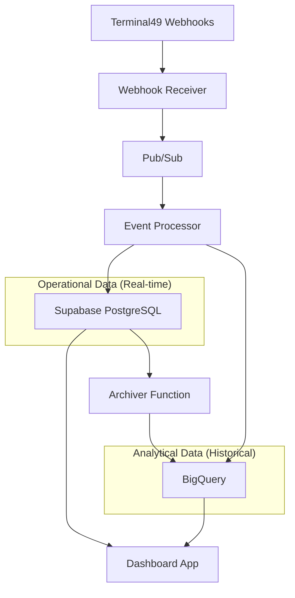

# Database Architecture Summary for Dashboard Application

## Executive Summary

This document provides a strategic overview of the Terminal49 tracking infrastructure database architecture, designed to support a comprehensive dashboard application with TEU analytics, vessel positioning, and operational summaries.

## Architecture Overview

### Hybrid Database Strategy

The system employs a **dual-database architecture** optimized for different use cases:

### Database Roles

#### Supabase PostgreSQL (Operational Database)
- **Purpose**: Real-time operational queries and dashboard data
- **Retention**: Active data (last 90 days)
- **Strengths**: Fast queries (<10ms), real-time subscriptions, ACID compliance
- **Use Cases**: Dashboard real-time data, current vessel positions, active shipments

#### BigQuery (Analytical Database)
- **Purpose**: Historical analysis, data archival, and complex analytics
- **Retention**: Long-term storage (2+ years)
- **Strengths**: Massive scale, cost-effective storage, analytical queries
- **Use Cases**: Historical trends, data mining, compliance reporting

## Core Data Entities

### 1. Shipments
**Strategic Role**: Master record for cargo movements
- **Key Attributes**: Bill of Lading, Carrier (SCAC), Port pairs, ETAs
- **Business Value**: Revenue tracking, performance analysis
- **Relationships**: One-to-many with containers

### 2. Containers
**Strategic Role**: Physical asset tracking
- **Key Attributes**: Container number, size/type, current status, location
- **Business Value**: Asset utilization, operational efficiency
- **TEU Calculation**: Equipment length determines TEU value (20'=1, 40'=2)

### 3. Container Events
**Strategic Role**: Audit trail and status tracking
- **Key Attributes**: Event type, timestamp, location, vessel information
- **Business Value**: Operational visibility, performance metrics
- **Data Pattern**: Append-only, high volume

### 4. Tracking Requests
**Strategic Role**: Subscription management
- **Key Attributes**: Request status, carrier, reference numbers
- **Business Value**: Service monitoring, coverage analysis

### 5. Webhook Deliveries
**Strategic Role**: System health monitoring
- **Key Attributes**: Processing status, performance metrics, error tracking
- **Business Value**: System reliability, operational monitoring

## Data Flow Architecture

### Real-time Data Pipeline
1. **Ingestion**: Terminal49 webhooks → Cloud Functions
2. **Processing**: Event transformation and entity extraction
3. **Storage**: Dual write to Supabase (operational) + BigQuery (archival)
4. **Consumption**: Dashboard queries from Supabase for real-time data

### Historical Data Pipeline
1. **Archival**: Automated daily archival from Supabase to BigQuery (90+ days)
2. **Analytics**: Complex analytical queries on BigQuery
3. **Reporting**: Historical trends and compliance reporting

## Dashboard Data Requirements

### 1. TEU Analytics by ISO Week and Carrier
**Data Sources**: 
- Primary: `containers` + `shipments` tables (Supabase)
- Historical: `events_historical` table (BigQuery)

**Key Calculations**:
- TEU = CASE WHEN equipment_length = 20 THEN 1 WHEN equipment_length = 40 THEN 2 ELSE 1 END
- ISO Week = EXTRACT(WEEK FROM created_at)
- Carrier = shipping_line_scac from shipments

### 2. Vessel Position Mapping
**Data Sources**:
- Primary: `containers` + `container_events` (Supabase)
- External: Terminal49 Vessel API for real-time positions

**Key Elements**:
- Active vessels from recent container events
- Vessel IMO numbers for API calls
- Current positions and movement status

### 3. Container and Shipment Summaries
**Data Sources**:
- Primary: `containers` + `shipments` + `container_events` (Supabase)
- Aggregations by carrier and vessel

**Key Metrics**:
- Container count by status and carrier
- Shipment count by carrier and vessel
- Operational KPIs (on-time performance, delays)

## Performance Characteristics

### Query Performance Targets
- **Real-time Dashboard**: <100ms response time
- **Aggregation Queries**: <500ms response time
- **Historical Analysis**: <5s response time

### Scalability Considerations
- **Current Volume**: 1,000-5,000 events/day
- **Peak Capacity**: 100 inserts/second
- **Storage Growth**: ~5GB/month in BigQuery

### Indexing Strategy
- **Supabase**: Optimized for operational queries with composite indexes
- **BigQuery**: Partitioned by date, clustered by frequently queried columns

## Data Quality and Governance

### Data Integrity
- **Idempotency**: All operations use Terminal49 event IDs for deduplication
- **Referential Integrity**: Foreign key constraints maintain data consistency
- **Audit Trail**: Complete event history preserved in append-only tables

### Data Retention
- **Operational**: 90 days in Supabase for fast access
- **Historical**: 2+ years in BigQuery for compliance and analysis
- **Raw Events**: Permanent retention for reprocessing capability

## Security and Compliance

### Access Control
- **Row Level Security**: Available in Supabase for multi-tenant scenarios
- **API Authentication**: Service account based access
- **Audit Logging**: Complete access and modification tracking

### Data Privacy
- **Encryption**: At rest and in transit
- **Access Patterns**: Principle of least privilege
- **Compliance**: Ready for SOC2, GDPR requirements

## Cost Optimization

### Current Costs (Monthly)
- **Supabase**: ~$25 (operational database)
- **BigQuery**: ~$0.16 (storage and queries)
- **Total**: ~$25.16/month at current scale

### Scaling Economics
- **10x Scale**: ~$27/month (BigQuery scales efficiently)
- **Cost Drivers**: Supabase compute, BigQuery storage
- **Optimization**: Automated archival reduces operational database size

## Integration Points

### Dashboard Application
- **Primary Connection**: Supabase for real-time data
- **Secondary Connection**: BigQuery for historical analysis
- **API Pattern**: RESTful queries with real-time subscriptions

### External APIs
- **Terminal49 Vessel API**: Real-time vessel positions
- **Authentication**: API key based
- **Rate Limits**: Consider caching strategies

## Recommendations for Dashboard Implementation

### Technology Stack
- **Frontend**: React/TypeScript with real-time capabilities
- **Backend**: Supabase client libraries for direct database access
- **Mapping**: Leaflet or Mapbox for vessel positioning
- **Charts**: Chart.js or D3.js for TEU analytics

### Data Access Patterns
1. **Real-time Queries**: Direct Supabase connection for current data
2. **Historical Analysis**: BigQuery for trends and deep analytics
3. **Caching Strategy**: Consider Redis for frequently accessed aggregations
4. **Real-time Updates**: Supabase real-time subscriptions for live updates

### Performance Optimization
1. **Query Optimization**: Use provided indexes and composite queries
2. **Data Aggregation**: Pre-calculate common metrics in materialized views
3. **Caching**: Implement application-level caching for expensive queries
4. **Connection Pooling**: Use connection pooling for database efficiency

---

*This architecture summary provides the strategic foundation for implementing a comprehensive Terminal49 tracking dashboard with optimal performance, scalability, and cost-effectiveness.*