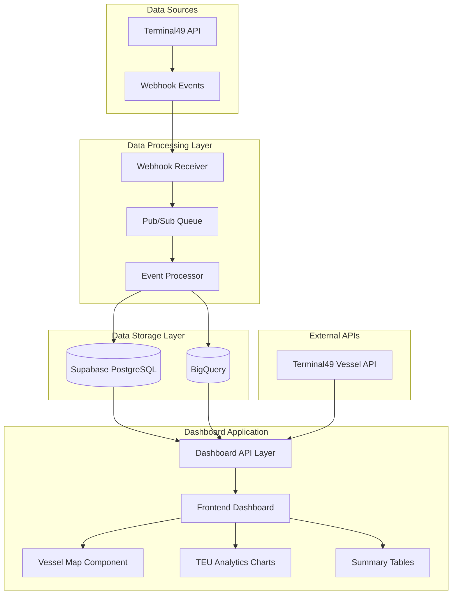
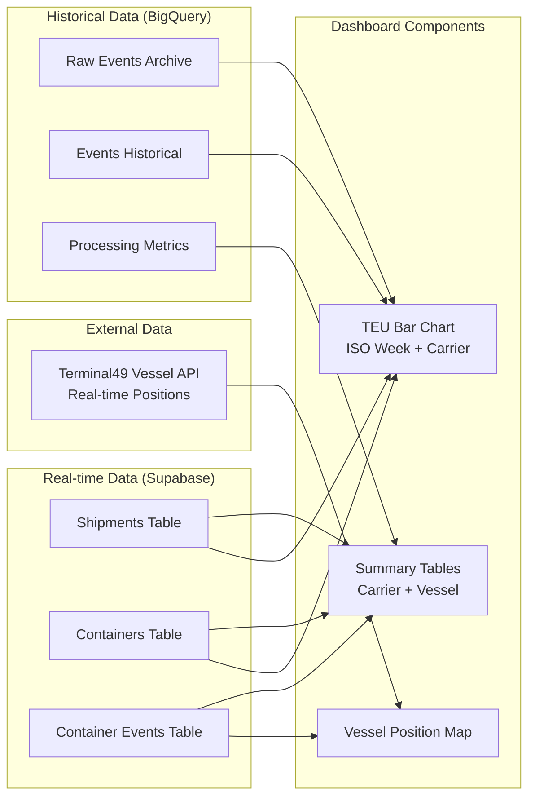
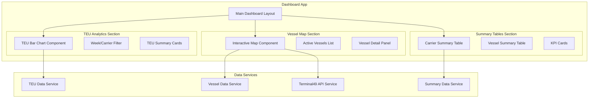

# Dashboard Implementation Guide

## Overview

This guide provides comprehensive implementation recommendations for building a Terminal49 tracking dashboard with TEU analytics, vessel positioning, and operational summaries.

## Data Flow Architecture

### High-Level Data Flow



### Dashboard Data Flow Details



## Implementation Architecture

### Technology Stack Recommendations

#### Frontend
- **Framework**: React 18+ with TypeScript
- **State Management**: Zustand or Redux Toolkit
- **UI Components**: shadcn/ui (already in project)
- **Charts**: Chart.js or Recharts for TEU analytics
- **Maps**: Leaflet with React-Leaflet for vessel positioning
- **Styling**: Tailwind CSS (already configured)

#### Backend/API Layer
- **Database Client**: Supabase JavaScript client
- **Real-time**: Supabase real-time subscriptions
- **API Calls**: Axios or native fetch for Terminal49 API
- **Caching**: React Query for client-side caching
- **Authentication**: Supabase Auth (if needed)

#### Data Processing
- **Primary Database**: Direct Supabase connection
- **Historical Analysis**: BigQuery client for complex analytics
- **Caching Strategy**: Redis (optional) for expensive queries

### Component Architecture



## Implementation Steps

### Phase 1: Foundation Setup
1. **Database Connection Setup**
   ```typescript
   // supabase-client.ts
   import { createClient } from '@supabase/supabase-js'
   
   const supabaseUrl = process.env.NEXT_PUBLIC_SUPABASE_URL!
   const supabaseKey = process.env.NEXT_PUBLIC_SUPABASE_ANON_KEY!
   
   export const supabase = createClient(supabaseUrl, supabaseKey)
   ```

2. **BigQuery Client Setup** (for historical data)
   ```typescript
   // bigquery-client.ts
   import { BigQuery } from '@google-cloud/bigquery'
   
   export const bigquery = new BigQuery({
     projectId: 'li-customer-datalake',
     keyFilename: process.env.GOOGLE_APPLICATION_CREDENTIALS
   })
   ```

3. **Terminal49 API Client**
   ```typescript
   // terminal49-client.ts
   const T49_API_BASE = 'https://api.terminal49.com/v2'
   const T49_API_KEY = process.env.TERMINAL49_API_KEY
   
   export const fetchVesselPosition = async (imo: string) => {
     const response = await fetch(`${T49_API_BASE}/vessels/${imo}`, {
       headers: {
         'Authorization': `Token ${T49_API_KEY}`
       }
     })
     return response.json()
   }
   ```

### Phase 2: Data Services Implementation

#### TEU Analytics Service
```typescript
// services/teu-analytics.ts
export interface TEUData {
  iso_week: number
  year: number
  carrier: string
  total_teus: number
  container_count: number
}

export const fetchTEUByWeekAndCarrier = async (weeks: number = 12): Promise<TEUData[]> => {
  const { data, error } = await supabase.rpc('get_teu_by_week_carrier', { weeks_back: weeks })
  if (error) throw error
  return data
}
```

#### Vessel Position Service
```typescript
// services/vessel-position.ts
export interface VesselPosition {
  vessel_imo: string
  vessel_name: string
  latitude?: number
  longitude?: number
  last_event_timestamp: string
  active_containers: number
}

export const fetchActiveVessels = async (): Promise<VesselPosition[]> => {
  const { data, error } = await supabase.rpc('get_active_vessels')
  if (error) throw error
  
  // Enrich with real-time positions from Terminal49 API
  const enrichedData = await Promise.all(
    data.map(async (vessel) => {
      try {
        const positionData = await fetchVesselPosition(vessel.vessel_imo)
        return {
          ...vessel,
          latitude: positionData.data.attributes.latitude,
          longitude: positionData.data.attributes.longitude
        }
      } catch (error) {
        console.warn(`Failed to fetch position for vessel ${vessel.vessel_imo}:`, error)
        return vessel
      }
    })
  )
  
  return enrichedData
}
```

### Phase 3: Component Implementation

#### TEU Bar Chart Component
```typescript
// components/TEUBarChart.tsx
import { Bar } from 'react-chartjs-2'
import { useQuery } from '@tanstack/react-query'
import { fetchTEUByWeekAndCarrier } from '@/services/teu-analytics'

export const TEUBarChart = () => {
  const { data: teuData, isLoading } = useQuery({
    queryKey: ['teu-by-week-carrier'],
    queryFn: () => fetchTEUByWeekAndCarrier(12),
    refetchInterval: 5 * 60 * 1000 // Refresh every 5 minutes
  })

  if (isLoading) return <div>Loading TEU data...</div>

  const chartData = {
    labels: [...new Set(teuData?.map(d => `Week ${d.iso_week}/${d.year}`))],
    datasets: [...new Set(teuData?.map(d => d.carrier))].map(carrier => ({
      label: carrier,
      data: teuData
        ?.filter(d => d.carrier === carrier)
        .map(d => d.total_teus) || [],
      backgroundColor: getCarrierColor(carrier)
    }))
  }

  return <Bar data={chartData} options={chartOptions} />
}
```

#### Vessel Map Component
```typescript
// components/VesselMap.tsx
import { MapContainer, TileLayer, Marker, Popup } from 'react-leaflet'
import { useQuery } from '@tanstack/react-query'
import { fetchActiveVessels } from '@/services/vessel-position'

export const VesselMap = () => {
  const { data: vessels, isLoading } = useQuery({
    queryKey: ['active-vessels'],
    queryFn: fetchActiveVessels,
    refetchInterval: 2 * 60 * 1000 // Refresh every 2 minutes
  })

  if (isLoading) return <div>Loading vessel positions...</div>

  return (
    <MapContainer center={[0, 0]} zoom={2} style={{ height: '500px' }}>
      <TileLayer url="https://{s}.tile.openstreetmap.org/{z}/{x}/{y}.png" />
      {vessels?.map(vessel => (
        vessel.latitude && vessel.longitude && (
          <Marker 
            key={vessel.vessel_imo}
            position={[vessel.latitude, vessel.longitude]}
          >
            <Popup>
              <div>
                <h3>{vessel.vessel_name}</h3>
                <p>IMO: {vessel.vessel_imo}</p>
                <p>Containers: {vessel.active_containers}</p>
                <p>Last Update: {new Date(vessel.last_event_timestamp).toLocaleString()}</p>
              </div>
            </Popup>
          </Marker>
        )
      ))}
    </MapContainer>
  )
}
```

### Phase 4: Database Functions (Supabase)

Create these SQL functions in Supabase for optimized queries:

```sql
-- Function: Get TEU by week and carrier
CREATE OR REPLACE FUNCTION get_teu_by_week_carrier(weeks_back INTEGER DEFAULT 12)
RETURNS TABLE (
    iso_week INTEGER,
    year INTEGER,
    carrier TEXT,
    total_teus BIGINT,
    container_count BIGINT
) AS $$
BEGIN
    RETURN QUERY
    SELECT 
        EXTRACT(WEEK FROM c.created_at)::INTEGER AS iso_week,
        EXTRACT(YEAR FROM c.created_at)::INTEGER AS year,
        s.shipping_line_scac AS carrier,
        SUM(
            CASE 
                WHEN c.equipment_length = 20 THEN 1
                WHEN c.equipment_length = 40 THEN 2
                ELSE 1
            END
        ) AS total_teus,
        COUNT(c.id) AS container_count
    FROM containers c
    JOIN shipments s ON c.shipment_id = s.id
    WHERE c.created_at >= CURRENT_DATE - (weeks_back || ' weeks')::INTERVAL
        AND s.shipping_line_scac IS NOT NULL
    GROUP BY 
        EXTRACT(WEEK FROM c.created_at),
        EXTRACT(YEAR FROM c.created_at),
        s.shipping_line_scac
    ORDER BY year DESC, iso_week DESC, total_teus DESC;
END;
$$ LANGUAGE plpgsql;

-- Function: Get active vessels
CREATE OR REPLACE FUNCTION get_active_vessels()
RETURNS TABLE (
    vessel_imo TEXT,
    vessel_name TEXT,
    active_containers BIGINT,
    active_shipments BIGINT,
    last_event_timestamp TIMESTAMPTZ,
    carriers TEXT[]
) AS $$
BEGIN
    RETURN QUERY
    SELECT DISTINCT
        ce.vessel_imo,
        ce.vessel_name,
        COUNT(DISTINCT ce.container_id) AS active_containers,
        COUNT(DISTINCT ce.shipment_id) AS active_shipments,
        MAX(ce.event_timestamp) AS last_event_timestamp,
        ARRAY_AGG(DISTINCT s.shipping_line_scac) FILTER (WHERE s.shipping_line_scac IS NOT NULL) AS carriers
    FROM container_events ce
    JOIN containers c ON ce.container_id = c.id
    JOIN shipments s ON ce.shipment_id = s.id
    WHERE ce.created_at >= CURRENT_DATE - INTERVAL '30 days'
        AND ce.vessel_imo IS NOT NULL
        AND ce.vessel_name IS NOT NULL
    GROUP BY ce.vessel_imo, ce.vessel_name
    HAVING MAX(ce.event_timestamp) >= CURRENT_DATE - INTERVAL '7 days'
    ORDER BY last_event_timestamp DESC;
END;
$$ LANGUAGE plpgsql;
```

## Performance Optimization

### Caching Strategy
1. **Client-side caching** with React Query (5-minute TTL for most data)
2. **Database function caching** for expensive aggregations
3. **API response caching** for Terminal49 vessel positions (2-minute TTL)

### Real-time Updates
```typescript
// Real-time subscription for container events
useEffect(() => {
  const subscription = supabase
    .channel('container-events')
    .on('postgres_changes', 
      { event: 'INSERT', schema: 'public', table: 'container_events' },
      (payload) => {
        // Update vessel positions or trigger data refresh
        queryClient.invalidateQueries(['active-vessels'])
      }
    )
    .subscribe()

  return () => subscription.unsubscribe()
}, [])
```

### Database Optimization
1. **Materialized views** for complex aggregations
2. **Partial indexes** on frequently filtered columns
3. **Connection pooling** with Supabase

## Security Considerations

### API Security
- Use environment variables for all API keys
- Implement rate limiting for Terminal49 API calls
- Use Supabase RLS (Row Level Security) if multi-tenant

### Data Access
- Limit database permissions to read-only for dashboard
- Use service accounts for BigQuery access
- Implement proper error handling and logging

## Deployment Recommendations

### Environment Setup
```bash
# Environment variables
NEXT_PUBLIC_SUPABASE_URL=your_supabase_url
NEXT_PUBLIC_SUPABASE_ANON_KEY=your_supabase_anon_key
TERMINAL49_API_KEY=your_terminal49_api_key
GOOGLE_APPLICATION_CREDENTIALS=path_to_bigquery_credentials.json
```

### Production Considerations
1. **CDN**: Use Vercel or similar for static asset delivery
2. **Monitoring**: Implement error tracking (Sentry)
3. **Analytics**: Track dashboard usage and performance
4. **Backup**: Regular database backups and disaster recovery

## Testing Strategy

### Unit Tests
- Test data transformation functions
- Test API service functions
- Test component rendering

### Integration Tests
- Test database queries
- Test Terminal49 API integration
- Test real-time subscriptions

### Performance Tests
- Load testing for dashboard queries
- API rate limit testing
- Real-time update performance

## Maintenance and Monitoring

### Key Metrics to Monitor
1. **Query Performance**: Database query execution times
2. **API Usage**: Terminal49 API call rates and errors
3. **Data Freshness**: Time since last data update
4. **User Experience**: Dashboard load times and errors

### Alerting
- Set up alerts for API failures
- Monitor database connection issues
- Track data processing delays

---

*This implementation guide provides a comprehensive roadmap for building a production-ready Terminal49 tracking dashboard with optimal performance, scalability, and maintainability.*